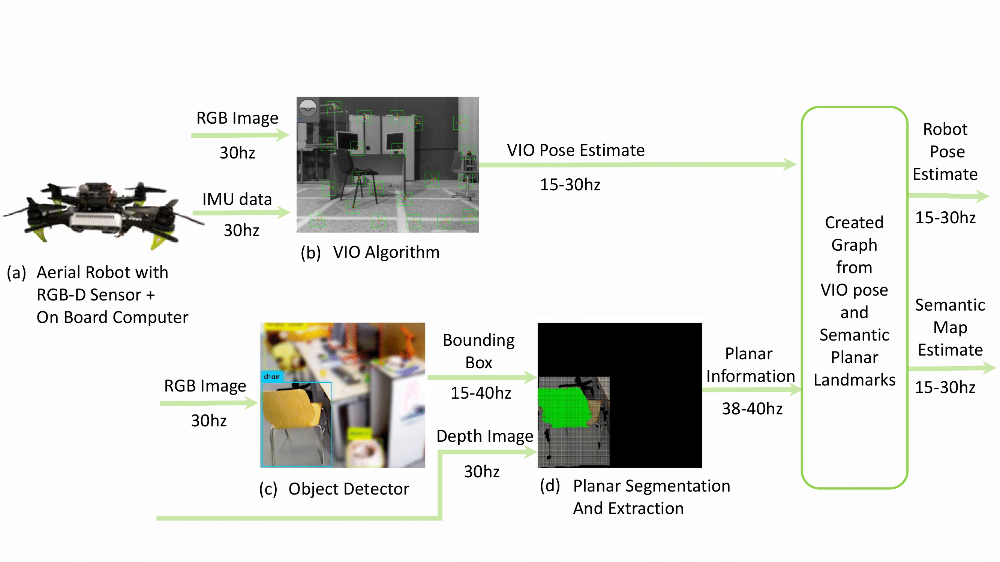
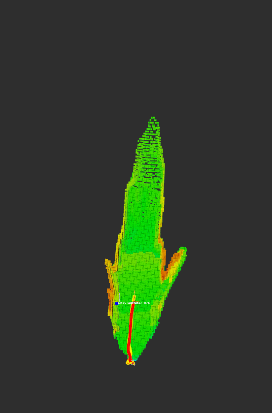

# Semantic SLAM #

This package can perform optimization of pose estimated from VO/VIO methods which tend to drift over time. It uses planar surfaces extracted from object detections in order to create a sparse semantic map of the environment, thus optimizing the drift of the VO/VIO algorithms.

### In order to run this package you will need two additional modules ###
- A VO/VIO algorithm: [ROVIO](https://github.com/ethz-asl/rovio), [VINS_MONO](https://github.com/HKUST-Aerial-Robotics/VINS-Mono), [OKVIS](https://github.com/ethz-asl/okvis) etc. 
- An Object Detector: [Yolo](https://github.com/leggedrobotics/darknet_ros), [Shape Color Detector](https://bitbucket.org/hridaybavle/bucket_detector)

Currently it can extract planar surfaces and create a semantic map from from the following objects:
- chair
- tvmonitor
- book
- keyboard
- laptop
- bucket
- car

### Related Paper: ###

**[VPS-SLAM: Visual Planar Semantic SLAM for Aerial Robotic Systems](https://ieeexplore.ieee.org/document/9045978)**, Hriday Bavle, Paloma de la Puente, Jonathan How, Pascual Campoy, Journal of IEEE Access.

### Video ###

<a href="https://vimeo.com/368217703" target="_blank"></a>

### How do I set it up? 

**First install g2o following these instructions (assuming ROS kinetic distribution):**
```
- sudo apt-get install ros-kinetic-libg2o
- sudo cp -r /opt/ros/kinetic/lib/libg2o_* /usr/local/lib
- sudo cp -r /opt/ros/kinetic/include/g2o /usr/local/include
```
**Install OctopMap server for map generation capabilities:**
```
- sudo apt install ros-kinetic-octomap*
```

### Try a simple example with pre-recorded VIO pose and a blue bucket detector:

**Create a ros workspace and clone the following packages:**

- Download the rosbag: 
```    
    wget -P ~/Downloads/ https://www.dropbox.com/s/jnywuvcn2m9ubu2/entire_lab_3_rounds.bag
```
- Create a workspace, clone the repo and compile:
```
    mkdir -p workspace/ros/semantic_slam_ws/src/ && cd workspace/ros/semantic_slam_ws/src/    
    git clone https://github.com/hridaybavle/semantic_slam && git clone https://bitbucket.org/hridaybavle/bucket_detector.git   
    cd .. && catkin build --cmake-args -DCMAKE_BUILD_TYPE=Release
```     
- Launch and visualize
```    
    source devel/setup.bash
    roslaunch semantic_SLAM ps_slam_with_snap_pose_bucket_det_lab_data_with_octomap.launch bagfile:=${HOME}/Downloads/entire_lab_3_rounds.bag show_rviz:=true  
```    



**Note: In the example above [octomap](http://wiki.ros.org/octomap_server) is used for mapping. Right now at loop closure the complete map is not optimized and will be done in the future. 

### Using Docker Image

If the code is giving problems with you local machine, you can try the docker image created with the repo and the required settings. 

**Download Docker from: [Docker](https://docs.docker.com/engine/install/ubuntu/)**

**Follow the commands to run the algorithm with the docker**
```
  docker pull hridaybavle/semantic_slam:v1 	
  docker run --rm -it --net="host" -p 11311:11311 hridaybavle/semantic_slam:v1 bash
  cd ~/workspace/ros/semantic_slam_ws/
  source devel/setup.bash
  roslaunch semantic_SLAM ps_slam_with_snap_pose_bucket_det_lab_data_with_octomap.launch bagfile:=${HOME}/Downloads/entire_lab_3_rounds.bag show_rviz:=false  
```
**Open a new terminal and rviz in local machine**
```
  cd ~/Downloads/ && wget https://raw.githubusercontent.com/hridaybavle/semantic_slam/master/rviz/graph_semantic_slam.rviz
  rviz -d graph_semantic_slam.rviz	
```

### Subsribed Topics 

- **/SQ04/snap_vislam/vislam/pose** ([geometry_msgs/PoseStamped](http://docs.ros.org/api/geometry_msgs/html/msg/PoseStamped.html))  
The default snapdragon VIO pose published in NED in frame. This message can be remapped remapped to any other VO pose message publishing in NED frame. ([See frame conventions](https://en.wikipedia.org/wiki/Axes_conventions))


- **/rovio/odometry** ([geometry_msgs/PoseStamped](http://docs.ros.org/melodic/api/nav_msgs/html/msg/Odometry.html))  
The VIO odometry published in ENU frame. Can be remapped to the desired topic name in the launcher. 


- **/depth_registered/points** ([sensor_msgs/PointCloud2](http://docs.ros.org/melodic/api/sensor_msgs/html/msg/PointCloud2.html)) 
The point cloud required for planar surface extraction. 


- **/darknet_ros/bounding_boxes**([darknet_msgs_ros/BoundingBoxes](https://github.com/leggedrobotics/darknet_ros))  
The detection bounding boxes published by yolo if using the yolo detector ros package. 

- **/image_processed/bounding_boxes**([ShapeColor_ObjectDetection/DetectedObjects](https://hridaybavle@bitbucket.org/hridaybavle/bucket_detector.git))
The detection bounding boxes if using the bucket detector. It can be downloaded from the link above. 


### Published Topics

- **robot_pose**([geometry_msgs/PoseStamped](http://docs.ros.org/melodic/api/nav_msgs/html/msg/Odometry.html)) 
The pose of the robot estimated by the algo.

- **robot_path**([nav_msgs/Path](http://docs.ros.org/melodic/api/nav_msgs/html/msg/Path.html))  
The path of the robot psoe for visualization.

- **keyframe_poses**([geometry_msgs/PoseArray](http://docs.ros.org/melodic/api/geometry_msgs/html/msg/PoseArray.html))  
The poses of the keyframe being added to the g2o graph.

- **mapped_landmarks**([visualization_msgs/MarkerArray](http://docs.ros.org/melodic/api/visualization_msgs/html/msg/MarkerArray.html))  
The mapped semantic planar surfaces.

- **detected_landmarks**([visualization_msgs/MarkerArray](http://docs.ros.org/melodic/api/visualization_msgs/html/msg/MarkerArray.html))  
The detected landmarks in the current frame. 

The configurations of the algorithms can be found inside the cfg folder in order to be changed accordingly.


### ANEXO I: CAMBIOS RELEVANTES REALIZADOS

- Se ha cambiado la definición del mensaje BoundingBox.msg añadiendole un float64 con la información de la profundidad.


- En semantic_graph_slam_ros.cpp, este script tiene como principal uso la recepción y envío de información:

  - Se han incorporado varias constantes mediante #define con los valores intrínsecos de la cámara RealSense D435I para convertir posición relativa de un objeto en la imagen y la profundidad a coordenadas 3D.

  - Se ha añadido en los ros::param una opción de usar CenterNet.

  - Añadida subscripción al publisher de CenterNet con una función callback, que extrae la coordenadas XYZ de una detección y envía la información de la detección mediante setDetectedObjectInfo(object_info). Por otro lado con las coordenadas XYZ de todas las detecciones en la imagen se crea una nube de puntos donde cada punto es el centroide de la detección y se envía mediante setPointCloudData(cloud_msg).


- semantic_graph_slam.cpp, en este script principalmente se procesa la información para posteriormente estimar la trayectoria:

  - En la función semantic_graph_slam::run() se ha añadido la opción de que si está en uso CenterNet se utilice otra función para procesar la información puesto que no hay planos que segmentar sino que cada punto ya es el propio centroide del objeto.

  - Esta función es semantic_centernet_data_ass que recibe el keyframe del momento con la información de cloud_msg y object_info y los une en coordenadas globales en una variable landmark que será la que utilice el algoritmo para la estimación de la trayectoria.


### ANEXO II: PROBLEMAS Y SOLUCIONES

En mi ordenador hubo algún problema al instalar las librería que utiliza semantic SLAM así que al final recurrí a la versión de docker que se describe más arriba. Después reemplazaba la versión de dentro del container por la modificada y corría sin problemas.

Otra incidencia que dió algún quebradero de cabeza fue que ROS utiliza de forma nativa python2.7 y CenterNet funciona con python3, se puede correr sin problemas pero es necesario explicitar el uso de python3 para el script.

Sin embargo, al recibir las imagénes publicadas en un tópico se reciben en un formato específico de ROS, para cambiarlo al formato de OpenCV o Numpy utilicé la librería CV_Bridge. Esta librería ROS hace que de forma predeterminada funcione con python2.7 así que al correr el script de CenterNet da ciertas incompatibilidades o dice que no encuentra la librería. Para solucionar esto es necesario explicitar durante la compilación la librería el uso de python3.


